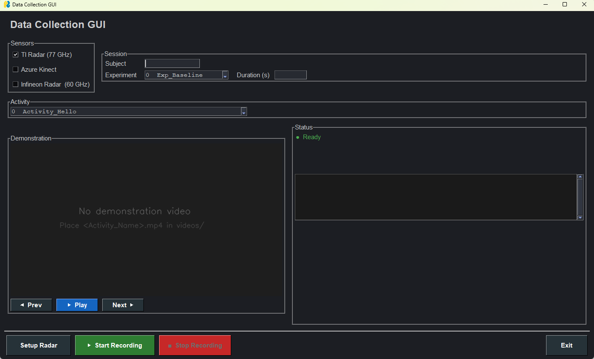

# Multi-Sensor Activity Data Collection GUI

A modular, multi-sensor data collection GUI for labelled activity research. It synchronises a **TI AWR2243BOOST 77 GHz radar** and an **Azure Kinect RGB-D camera** to capture recordings of any activity.

Each session:
- shows a per-activity demonstration video before capture
- saves data in an experiment → subject → activity folder hierarchy

> **Infineon 60 GHz radar** support is in progress — the module stub is already in place.

## Quick start (Windows)

1. Install mmWave Studio + Azure Kinect SDK (see below)
2. `pip install -r requirements.txt`
3. Update paths in `sensors/kinect_azure.py` and `cf.json`
4. Start mmWave Studio and run `radar_server.lua`
5. Run the GUI:

```bash
python main.py
```

---



---

## Hardware Requirements

| Device | Role | Part / Model |
|---|---|---|
| TI AWR2243BOOST | 77 GHz mmWave radar sensor | AWR2243BOOST EVM |
| TI DCA1000EVM | Raw ADC data capture card | DCA1000EVM |
| Azure Kinect DK | RGB-D camera (colour + depth) | Model 1550 |
| Windows 10/11 PC | Host computer and data storage | USB 3.0 port required |

---

## Network Configuration (DCA1000EVM)

The DCA1000EVM connects to your PC over Ethernet using a fixed IP scheme.

1. Plug an Ethernet cable **directly** between the DCA1000EVM and your PC (no router/switch).
2. Configure the PC Ethernet adapter:
   - IP address: `192.168.33.30`
   - Subnet mask: `255.255.255.0`
   - Gateway: leave blank
3. The DCA1000EVM will be at `192.168.33.180` (factory default).

> If you change these IPs, update `cf.json` and `radar_server.lua` to match.

---

## Software Installation

### 1. mmWave Studio 03.00.00.14

Download the installer from the TI download page:

> **[MMWAVE-STUDIO-2G — version 03_00_00_14](https://software-dl.ti.com/ra-processors/esd/MMWAVE-STUDIO-2G/latest/index_FDS.html)**

Install to the default path: `C:\ti\mmwave_studio_03_00_00_14\`

After installation, copy `radar_server.lua` (from this repo root) into:
```
C:\ti\mmwave_studio_03_00_00_14\mmWaveStudio\Scripts\
```

### 2. Azure Kinect SDK v1.4.2

Download and run the installer from the GitHub releases page:

> **[Azure Kinect SDK v1.4.2 — github.com/microsoft/Azure-Kinect-Sensor-SDK/releases/tag/v1.4.2](https://github.com/microsoft/Azure-Kinect-Sensor-SDK/releases/tag/v1.4.2)**

Install to the default path: `C:\Program Files\Azure Kinect SDK v1.4.2\`

Verify the recorder tool is present:
```
C:\Program Files\Azure Kinect SDK v1.4.2\tools\k4arecorder.exe
```

> **Important:** Plug the Kinect into a **dedicated USB 3.0 port** — not a USB hub. The combined colour + depth stream requires the full USB 3.0 bandwidth. Sharing the port causes frame-drop errors (`capturesync_drop`).

### 3. Python Dependencies

Python 3.10 or later on Windows is required.

```bash
pip install -r requirements.txt
```

Or install individually:
```bash
pip install PySimpleGUI opencv-python numpy openpyxl
```

---

## Configuration — Update Paths for Your Machine

Two files contain paths that **must be changed** before first use:

### `sensors/kinect_azure.py`

Find the `K4A_RECORDER` constant near the top of the file:
```python
K4A_RECORDER = r'C:\Program Files\Azure Kinect SDK v1.4.2\tools\k4arecorder.exe'
```
Update if you installed the SDK to a different location.

### `cf.json`

Find the `fileBasePath` field and replace `<YOUR_USERNAME>` with your Windows username:
```json
"fileBasePath": "C:\\Users\\<YOUR_USERNAME>\\radar_data"
```

---

## mmWave Studio Setup (run once per session)

The GUI controls the TI radar through a small Lua TCP server embedded in mmWave Studio.

1. Open **mmWave Studio**
2. Connect to the **AWR2243BOOST** (select the correct COM port)
3. Click **Power On** → **RF Enable**
4. Load your chirp / profile / frame configuration
5. Connect to the DCA1000EVM via Ethernet (verify `192.168.33.180` is reachable)
6. Open the **Script editor**: `Scripts > Open > radar_server.lua`
7. Click **Run** (or press **F5**)
8. The log window should display:

```
===========================================
 Radar server started on port 55000
 Waiting for commands from Python GUI...
===========================================
```

Leave mmWave Studio open. The GUI will communicate with it over TCP on port 55000.

---

## Running the GUI

Open a Windows Command Prompt and run:

```bash
python main.py
```

On first launch, click **Setup Radar** — this sends the DCA1000 Ethernet and capture-mode configuration to mmWave Studio over the Lua connection. The status bar should show `● Radar ready`.

---

## Activities and Demonstration Videos

### `activities.xlsx`

The Excel workbook has two sheets that populate the GUI dropdowns:

| Sheet | Columns | Example row |
|---|---|---|
| `Activities` | `id` (int), `name` (str) | `0`, `Activity_Hello` |
| `Experiments` | `id` (int), `name` (str) | `0`, `Exp_Baseline` |

To add a new activity or experiment, open the workbook, add a row to the appropriate sheet, and restart the GUI.

### `videos/` folder — Demonstration Videos

Before a recording the GUI shows a preview of the selected activity.  To add a demonstration video:

1. Record or obtain an `.mp4` clip of the activity
2. Name it **exactly** matching the `name` column in `activities.xlsx`
3. Place it in the `videos/` folder

```
videos/
  Activity_Hello.mp4
  Activity_Goodbye.mp4
  Activity_Thank_You.mp4
  ...
```

When an activity is selected in the GUI the first frame of the matching video is shown.  If no video is found a placeholder is displayed instead.

Use the **◀ Prev** and **Next ▶** buttons to cycle through activities without touching the dropdown.

---

## Recording Workflow

1. Check the sensors you want to use (**TI Radar**, **Azure Kinect**, or both)
2. Enter a **Subject** identifier (number or short name)
3. Select an **Experiment** and **Activity** from the dropdowns
4. Enter the **Duration** in whole seconds
5. Click **▶ Start Recording**
   - A 3-2-1 countdown appears in the status bar
   - All enabled sensors start simultaneously in background threads
   - A live MM:SS countdown shows the remaining time
6. Recording stops automatically when the duration expires; saved files are listed in the status panel
7. Click **■ Stop Recording** to terminate early if needed

---

## Output Structure

All recordings are saved under `C:\Users\<YOUR_USERNAME>\radar_data\outputs\` on Windows, organised by experiment → subject → activity:

```
outputs/
  Exp_Baseline/
    subj1/
      Activity_Hello/
        2026_04_16_14_30_00.bin           ← TI radar raw ADC data (DCA1000)
        2026_04_16_14_30_00_Raw_0.bin     ← DCA1000 appends this suffix automatically
        2026_04_16_14_30_00_kinect.mkv    ← Azure Kinect RGB-D recording (MKV)
        2026_04_16_14_30_00_inf.bin       ← Infineon radar (when available)
  Exp_Controlled/
    subj2/
      Activity_Goodbye/
        ...
```

Each recording session gets its own timestamped set of files inside the activity folder.

---

## Project Structure

```
├── main.py                  # GUI entry point
├── activities.xlsx          # Activity and experiment definitions
├── cf.json                  # DCA1000 capture configuration
├── requirements.txt
├── radar_server.lua         # Lua TCP server — runs inside mmWave Studio
│
├── sensors/
│   ├── __init__.py
│   ├── kinect_azure.py      # Azure Kinect recorder (wraps k4arecorder.exe)
│   ├── ti_radar.py          # TI AWR2243 recorder (Lua TCP client)
│   └── infineon_radar.py    # Infineon 60 GHz — coming soon
│
├── videos/                  # Demonstration video clips (not tracked by git)
│   └── README.txt
│
└── data/
    └── blank.png            # Placeholder image
```

---

## Troubleshooting

| Symptom | Likely cause | Fix |
|---|---|---|
| `error: Lua server not running` | `radar_server.lua` not started | Open in mmWave Studio Scripts editor and press F5 |
| `capturesync_drop` errors from Kinect | USB bandwidth saturation | Use a dedicated USB 3.0 port; avoid USB hubs |
| Kinect process times out and returns rc=1 | Bandwidth or USB issue | Reduce depth mode to `NFOV_2X2BINNED` and colour to `720p` in `sensors/kinect_azure.py` (already the defaults) |
| `k4arecorder.exe not found` | SDK not installed or wrong path | Install Azure Kinect SDK v1.4.2; update `K4A_RECORDER` in `sensors/kinect_azure.py` |
| No `.bin` file after recording | Radar not triggered | Confirm mmWave Studio is configured, radar is armed, and Lua server is running |
| GUI freezes during recording | All sensor operations run in a background thread — this should not happen | Check the console for Python exceptions |

---

## Infineon Radar — Coming Soon

`sensors/infineon_radar.py` is a stub with the correct interface (`start` / `wait` / `stop`).  SDK integration for the Infineon 60 GHz board is in progress.

---

## License

MIT
